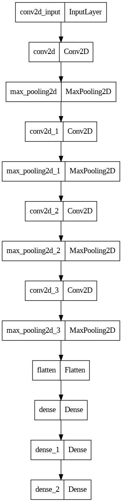

## Model description

More information needed

## Intended uses & limitations

More information needed

## Training and evaluation data

More information needed

## Training procedure

### Training hyperparameters

The following hyperparameters were used during training:

| Hyperparameters | Value |
| :-- | :-- |
| name | Adam |
| weight_decay | None |
| clipnorm | None |
| global_clipnorm | None |
| clipvalue | None |
| use_ema | False |
| ema_momentum | 0.99 |
| ema_overwrite_frequency | None |
| jit_compile | False |
| is_legacy_optimizer | False |
| learning_rate | 0.0010000000474974513 |
| beta_1 | 0.9 |
| beta_2 | 0.999 |
| epsilon | 1e-07 |
| amsgrad | False |
| training_precision | float32 |

 ## Model Plot

View Model Plot

